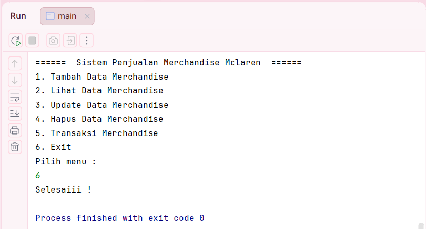

POSTTEST 1
PEMROGRAMAN BERORIENTASI OBJEK

Sistem Penjualan Merchandise McLaren

Nama    : Aulia Natasya
NIM     : 2409106084
Kelas   : B2'24

Program ini adalah aplikasi berbasisi java yang digunakan untuk mengelola data
merchandise dari tim Formula 1 McLaren. Program ini dapat melakukan operasi CRUD (Create, Read, Update, Delete)
menggunakan ArrayList untuk menyimpan data merchandise. Program juga memiliki fitur transaksi pembelian yang akan
mengurangi stok merchandise secara otomatis.

Program ini memiliki tiga class:
1. Main
    Class utama yang menjalankan menu program dan mengatur proses CRUD serta transaksi.
2. Merchandise
    Class yang digunakan untuk menyimpan data merchanise, seperti:
    - id merchandise
    - nama merchandise
    - harga merchandise
    - stok merchandise
3. Transaksi
    Class yang digunakan untuk menyimpan data transaksi pembelian, seperti:
    - nama merchandise
    - jumlah pembelian
    - total harga

Program ini memiliki fitur yaitu:
1. Create     : Untuk menambahkan data merchandise baru.
2. Read       : Untuk menampilkan seluruh data merchandise.
3. Update     : Untuk mengubah data merchandise yang sudah ada.
4. Delete     : Untuk menghapus data merchandise dari daftar.
5. Transaksi  : Untuk melakukan pembelian merchandise dan menghitung total harga.
6. Exit       : untuk keluar dari program.

Penjelasan
1. Method Tambah Data
   Method tambahData() digunakan untuk menambahkan data merchandise baru. Pengguna diminta memasukkan ID, nama merchandise, harga, dan stok. Setelah data dimasukkan, program membuat objek merchandise dan menyimpannya ke dalam ArrayList data.

2. Method Lihat Data
   Method lihatData() digunakan untuk menampilkan seluruh data merchandise. Jika data masih kosong, program akan menampilkan pesan bahwa data belum tersedia. Jika ada data, program akan menampilkan semua merchandise yang tersimpan.

3. Method Update Data
Method updateData() digunakan untuk mengubah data merchandise berdasarkan ID. Jika ID ditemukan, pengguna dapat mengganti nama, harga, dan stok merchandise dengan data baru.

4. Method Hapus Data
Method hapusData() digunakan untuk menghapus data merchandise dari daftar berdasarkan ID yang dimasukkan oleh pengguna.

5. Method Transaksi
Method transaksi() digunakan untuk melakukan pembelian merchandise. Program akan mengecek stok yang tersedia, menghitung total harga pembelian, lalu mengurangi stok merchandise sesuai jumlah yang dibeli.

Tampilan output program:
1. Menu Utama
    Tampilan menu utama saat program pertama kali dijalankan.

2. Tambah Data Merchandise (Create)
    Proses memasukan data merchandise baru ke sistem.

3. Menampilkan Data Merchandise (Read)
    Menampilkan daftar seluruh merchandise yang telah tersimpan.

4. Mengubah Data Merchandise (Update)
    Untuk memperbaharui informasi merchandise berdasarkan ID.

5. Menghapus Data Merchandise (Delete)
    Digunakan untuk menghapus data merchandise dari daftar.

    

6. Transaksi Pembelian
   Terdapat transaksi sederhana untuk melakukan pembelian merchandise serta menghitung total harga secara otomatis. 

7. Keluar dari Program (Exit)
    Program akan berhenti ketika pengguna memilih menu keluar.
