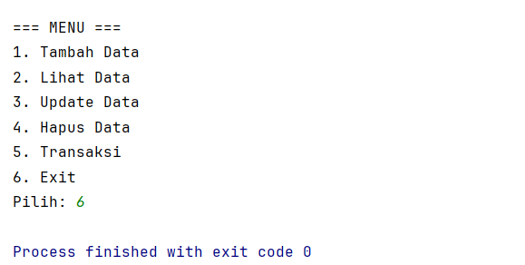

POSTTEST 4
PEMROGRAMAN BERORIENTASI OBJEK

Sistem Penjualan kategori.Merchandise McLaren

Nama    : Aulia Natasya
NIM     : 2409106084
Kelas   : B2'24

Program ini merupakan lanjutan dari Posttest 3. Di dalam Posttest 4 ini program masih sama yaitu untuk mengelola data
merchandise dari tim Formula 1 McLaren. Pada posttest ini, program tidak hanya menerapkan konsep inheritance, tetapi juga menambahkan konsep polymorphism dalam pemrograman berorientasi objek.
Inheritance merupakan konsep pewarisan di mana sebuah class dapat mewarisi atribut dan method dari class lain.
Dalam program ini, class Merchandise berperan sebagai superclass, sedangkan class TShirt, Outerwear, Headwear, dan Accessories merupakan subclass yang mewarisi atribut dan method dari class tersebut.

Untuk penerapan poymorphism:
1. Method Overriding
   Method tampilData() dioverride di setiap subclass untuk menampilkan informasi yang berbeda sesuai jenis merchandise.
2. Method Overloading
   Method hitungTotal() pada class Transaksi memiliki dua bentuk: Tanpa member dan dengan member (mendapat potongan harga)

Program ini memiliki tujuh class:
1. Main
   Class utama yang menjalankan menu program dan mengatur proses CRUD serta transaksi.
2. kategori.Merchandise
   Class yang digunakan untuk menyimpan data merchanise, seperti:
    - id merchandise
    - nama merchandise
    - harga merchandise
    - stok merchandise
3. T-Shirt
   Subclass dari merchandise yang memiliki atribut tambahan berupa ukuran.
4. kategori.Outerwear
   Subclass dari merchandise yang memiliki atribut tambahan berupa ukuran dan tipe seperti jaket atau hoodie.
5. kategori.Headwear
   Subclass dari merchandise yang memiliki atribut tambahan berupa jenis dari headwear seperti cap atau beanie.
6. kategori.Accessories
   Subclass dari merchandise yang memiliki atribut tambahan berupa jenis dari headwear seperti kacamata, keyring, atau poster.
7. Transaksi
   Class yang digunakan untuk menyimpan data transaksi pembelian, seperti:
    - nama merchandise
    - jumlah pembelian
    - total harga

Program ini memiliki fitur yaitu:
1. Create     : Untuk menambahkan data merchandise baru.
2. Read       : Untuk menampilkan seluruh data merchandise.
3. Update     : Untuk mengubah data merchandise yang sudah ada.
4. Delete     : Untuk menghapus data merchandise dari daftar.
5. Transaksi  : Untuk melakukan pembelian merchandise dan menghitung total harga.
6. Exit       : untuk keluar dari program.

Penjelasan
1. Method Tambah Data
   Method tambahData() digunakan untuk menambahkan data merchandise baru. Pengguna diminta memasukkan ID, nama, harga, dan stok, kemudian memilih jenis merchandise. Setelah itu, program akan membuat objek sesuai subclass yang dipilih (kategori.TShirt, kategori.Outerwear, kategori.Headwear, atau kategori.Accessories) dan menyimpannya ke dalam ArrayList.
   
   

2. Method Lihat Data
   Method lihatData() digunakan untuk menampilkan seluruh data merchandise. Jika data kosong, program akan menampilkan pesan bahwa data belum tersedia. Jika data ada, maka semua data akan ditampilkan menggunakan perulangan.
   

3. Method Update Data
   Method updateData() digunakan untuk mengubah data berdasarkan ID. Jika ID ditemukan, maka pengguna dapat mengubah nama, harga, dan stok menggunakan method setter karena atribut bersifat private.
   

4. Method Hapus Data
   Method hapusData() digunakan untuk menghapus data merchandise berdasarkan ID yang dimasukkan pengguna dengan menggunakan perulangan.
   

5. Method Transaksi
   Method transaksi() digunakan untuk melakukan pembelian merchandise. Program akan mengecek stok yang tersedia, menghitung total harga pembelian, lalu mengurangi stok merchandise sesuai jumlah yang dibeli. 
   

Tampilan output program:
1. Menu Utama
   Tampilan menu utama saat program pertama kali dijalankan.
   

2. Tambah Data kategori.Merchandise (Create)
   Proses memasukan data merchandise baru ke sistem.
   

3. Menampilkan Data kategori.Merchandise (Read)
   Menampilkan daftar seluruh merchandise yang telah tersimpan.
   

4. Mengubah Data kategori.Merchandise (Update)
   Untuk memperbaharui informasi merchandise berdasarkan ID.
   

5. Menghapus Data kategori.Merchandise (Delete)
   Digunakan untuk menghapus data merchandise dari daftar.
   

6. Transaksi Pembelian
   Terdapat transaksi sederhana untuk melakukan pembelian merchandise serta menghitung total harga secara otomatis.
   
   

7. Keluar dari Program (Exit)
   Program akan berhenti ketika pengguna memilih menu keluar.
   